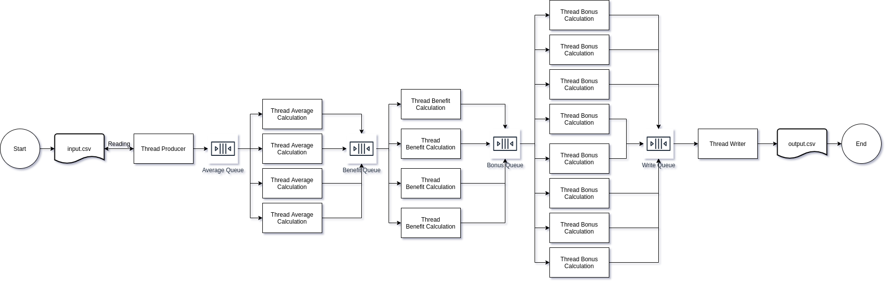

# priorityBlockingQueueExample
priorityBlockingQueueExample

for technical test hijra/alami. 

I use PriorityBlockingQueue to make sure the end result is in order. 
The challenge with BlockingQueue is that it blocks if the buffer is empty,
therefore, sentinel data (proportional with number of the consumer) needs to be inserted 
at the end of the queue  and a function in each consumer needs also to be programmed in order 
to recognize the sentinel data that all data has been consumed.

